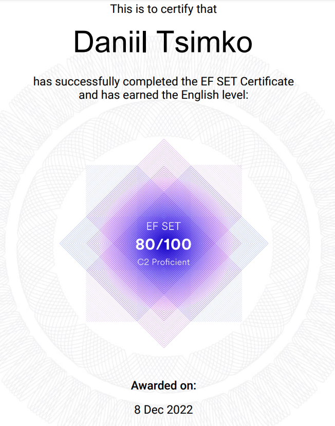

# **Daniil Tsimko**
### **My Contact Info**
* **Adress:** Minsk, Belarus
* **E-mail:** missed.all.the.boats@mail.ru
* **GitHub:** [danya-maatb](https://github.com/danya-maatb)
* **Telegram:** [danya_maatb](https://t.me/danya_maatb)
* **Phone:** +375 44 541-51-35
* **Discord:** Danya#5449

***
### **About me** 
I am 22 years old, I work as an engineer in Belarusian National Technical University. My goal here is to gain knowledge in the field of front-end development so as to apply for a job in the field that i'm actually interested in.

***
### **Skills**
* JavaScript (*in progress...*)
* Git/GitHub (*in progress...*)

***
### **Code Sample**
```
function add(num1, num2) {
  let arr1=String(num1).split('').reverse();
  let arr2=String(num2).split('').reverse();
  let n=[];
  if (arr1.length >= arr2.length) {
    for (let i=0; i<arr1.length; i++) {
      if (arr2 [i]===undefined) { arr2[i] = 0;}
      n[i]=Number(arr1[i])+Number(arr2[i]);
    }
  } else {
    for (let i=0; i<arr2.length; i++) {
      if (arr1 [i]===undefined) { arr1[i] = 0;}
      n[i]=Number(arr2[i])+Number(arr1[i]);
    }
  }
  return +n.reverse().join('');
}
```

***

### **Education**
* Belarusian National Technical University
    + Economics and organization of production
* RSSchool JS/FE Pre-School 2022Q4
* RSSchool JS/FE Pre-School 2023Q1 (*in progress...*)
* JavaScript Manual on [learn.javascript.ru](https://learn.javascript.ru/) (*in progress...*)

***

### **Languages**
* *Belarussian* - basic
* *Russian* - native
* *English* - C2 Proficient 
(according to online test at  - [EFSET](https://www.efset.org/) [certificate](https://www.efset.org/cert/unBbM1)): 

